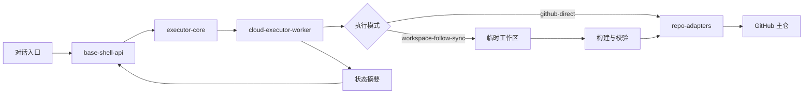

# 云端执行体拓扑

## 目标

把长流程开发、校验、自动跟传与止损放到服务器侧持续执行，同时保持 GitHub 仓库作为唯一正式写入面。

## 核心角色

- `对话入口`：少量规划、任务下发、结果审阅
- `base-shell-api`：控制面，负责提交任务、查询状态、暴露策略与健康接口
- `executor-core`：任务模型、去重、止损、状态存储、工作区与提交逻辑
- `cloud-executor-worker`：执行面，消费任务并调用仓库适配器
- `repo-adapters`：提供 GitHub 主写入与后续国内镜像同步能力

## 两种执行模式

### 1. `github-direct`

- 直接生成目标文件内容
- 通过仓库适配器批量写入 GitHub
- 适合计划文档、架构文档、明确文件改动、可直接生成的模块代码

### 2. `workspace-follow-sync`

- 先在临时工作区或受控工作区内完成改动
- 执行必要的构建与校验
- 由自动跟传助手把指定文件批量回写 GitHub
- 适合需要先在工作区完成处理的场景，但工作区仍不是最终归档位置

## 任务生命周期

1. 控制面接收任务并计算任务指纹
2. 如果存在相同指纹且仍未结束的任务，则直接返回原任务
3. Worker 领取队列中的任务并进入 `running`
4. 需要校验时进入 `validating`
5. 需要回写时进入 `syncing`
6. 成功则进入 `completed`
7. 同任务同阶段失败达到上限则进入 `blocked`

## 状态摘要规则

- 只返回当前阶段、结论、失败原因、是否止损、下一步动作
- 不回传大体量构建日志
- 敏感信息只留在服务器内存或状态目录，不写入仓库

## 最小执行闭环

