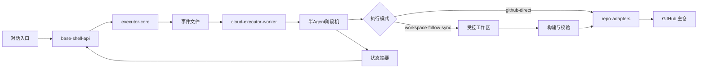

# 云端执行体拓扑

## 目标

把长流程开发、校验、自动跟传与止损放到服务器侧按事件推进执行，同时保持 GitHub 仓库作为唯一正式写入面。

## 对用户可见的原则

- 用户只和总控对话入口交互
- 用户只看结果、进度、异常与最小操作提示
- 半 Agent、事件监听器、状态合并器都属于内部执行结构，不直接暴露给用户

## 核心角色

- `对话入口`：接收任务、返回结果、只暴露人能理解的状态
- `base-shell-api`：控制面，负责提交任务、查询状态、暴露策略与健康接口
- `executor-core`：任务模型、事件管道、半 Agent 合并、止损、工作区与提交逻辑
- `cloud-executor-worker`：执行面，默认待机，监听事件后推进下一半 Agent
- `repo-adapters`：提供 GitHub 主写入与后续国内镜像同步能力

## 两种执行模式

### 1. `github-direct`

- 直接生成目标文件内容
- 通过仓库适配器批量写入 GitHub
- 适合计划文档、架构文档、明确文件改动、可直接生成的模块代码

### 2. `workspace-follow-sync`

- 先在受控工作区内完成改动
- 执行必要的构建与校验
- 由自动跟传助手把指定文件批量回写 GitHub
- 适合需要先在工作区完成处理的场景，但工作区仍不是最终归档位置

## 半 Agent 任务生命周期

1. 控制面接收任务并计算任务指纹
2. 如果存在相同指纹且仍未结束的任务，则直接返回原任务
3. `context-loader` 被事件唤醒，装载任务边界与目标路径
4. `memory-injector` 完成记忆与路径映射注入，并与前一半合并
5. `task-executor` 执行真实改动与仓库写回
6. `progress-recorder` 记录执行摘要，并与执行半 Agent 合并
7. `merge-guard` 确认前序阶段全部闭环
8. `next-waker` 释放 `task.completed` 事件，供下一任务链使用
9. 任一半 Agent 未能完成合并，则该任务保持未完成状态；失败达到上限后进入 `blocked`

## 状态摘要规则

- 对外只返回当前阶段、结论、失败原因、是否止损、下一步动作
- 不回传大体量构建日志
- 敏感信息只留在服务器内存或状态目录，不写入仓库
- 对用户使用人话状态，例如“处理中”“已完成”“需你操作”

## 最小执行闭环

